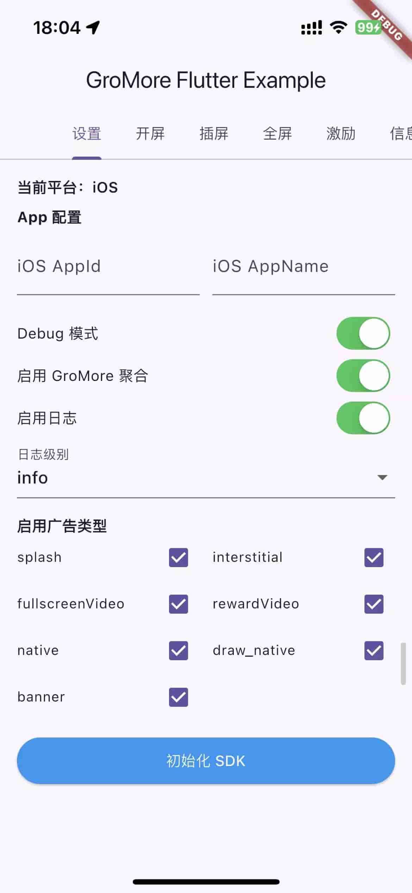
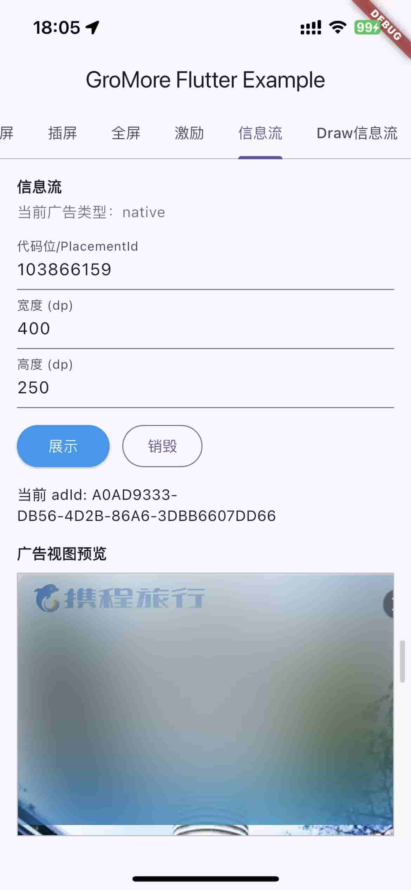
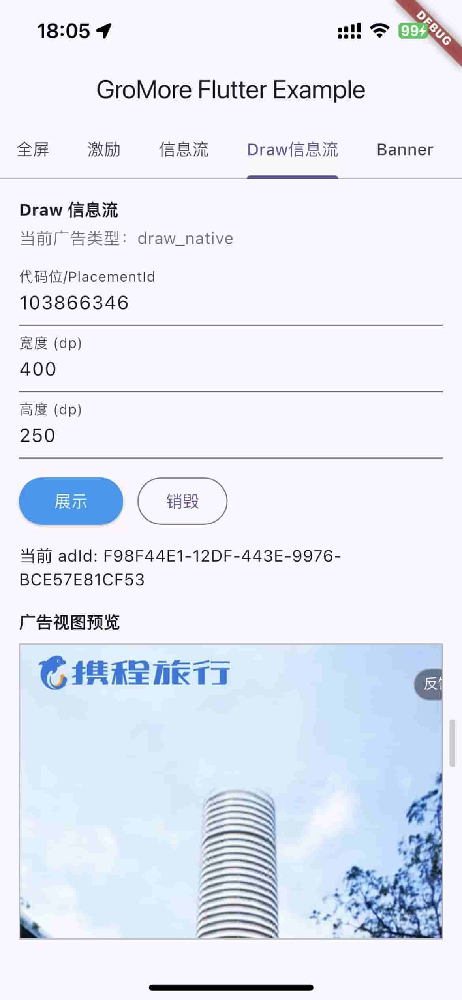
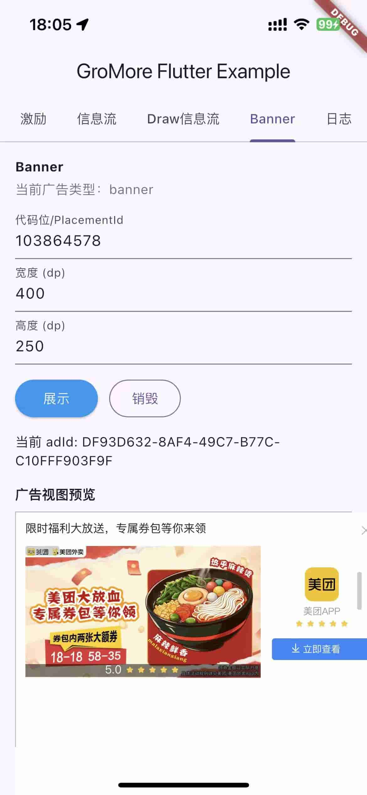
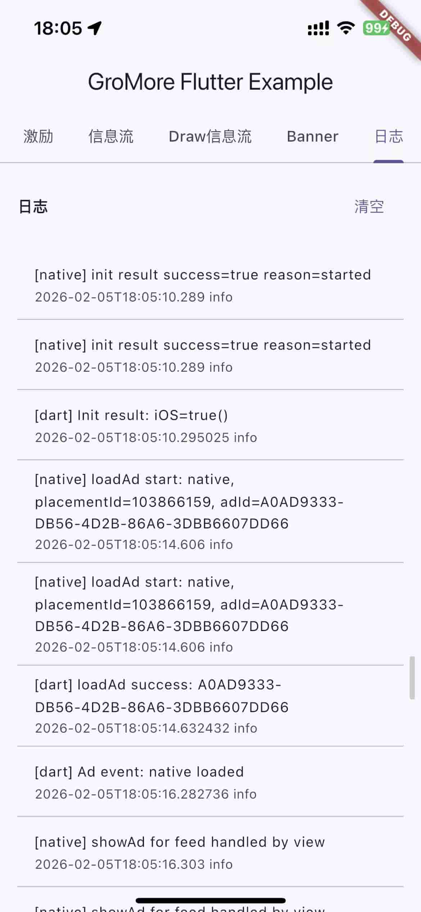

<div align="center">

【♻️ 持续更新】一款优质的 GroMore 聚合 Flutter 广告插件，支持多广告类型、事件回调与多 ADN 配置。


# 📱 Flutter GroMore Ads

<hr>


邮箱📬 [xm_sean@163.com](mailto:xm_sean@163.com)

</div>

> 中文：本仓库为源码可见项目。允许 fork 仅用于评估、测试、修复问题并通过 Pull Request 回馈主仓库；不允许将本项目或修改版本重新发布为独立插件、SDK、package 或竞品。详见 [LICENSE](LICENSE)、[LICENSE.zh-CN.md](LICENSE.zh-CN.md) 与 [CONTRIBUTING.md](CONTRIBUTING.md)。

## 🚀 核心功能

- ✅ 开屏广告
- ✅ 插屏广告
- ✅ 全屏视频
- ✅ Banner
- ✅ 激励视频
- ✅ 信息流（模板/Express + 内置默认自渲染样式）
- ✅ Draw 信息流

## 📡 示例截图

<div align="center">
  
  
  
  
  
</div>

## 📱 系统要求

- Android：`minSdk 24`
- iOS：`13.0+`

## ⚡ 5 分钟接入

当前插件版本：`2.2.0`；内置 Android GroMore `7.8.1.4`、iOS Ads-CN-Beta `7.8.0.5`。

### 1. 添加依赖

```yaml
dependencies:
  gromore_flutter: ^2.2.0
```

执行：

```bash
flutter pub get
```

### 2. 初始化

普通单进程应用只需要传入当前平台的 AppId：

```dart
import 'package:flutter/foundation.dart';
import 'package:gromore_flutter/gromore_flutter.dart';

final result = await GromoreFlutter.instance.initialize(
  androidAppId: 'your_android_app_id', // Android 使用
  iosAppId: 'your_ios_app_id' // iOS 使用
);
```

初始化返回 `InitResult`；需要展示错误时再读取 `result.android` 或 `result.ios`。

这些配置都有默认值，普通接入不需要重复填写：

- `androidAppName`：Android 会自动读取应用名称。
- `iosAppName`：保留用于兼容旧配置，当前 iOS SDK 初始化不依赖它。
- `debug`：默认关闭。
- `useMediation`：默认开启。
- `enabledAdTypes`：默认启用全部广告类型。
- `enableLog`：Debug 默认开启，Release 默认关闭。

如果需要在用户同意隐私协议前限制 SDK 采集，可以额外传入：

```dart
await GromoreFlutter.instance.initialize(
  androidAppId: 'your_android_app_id',
  iosAppId: 'your_ios_app_id',
  privacy: GromorePrivacyConfig.disableAll(),
);
```

### 高级初始化（可选）

`initialize(...)` 是普通接入的快捷入口，只处理 AppId 和隐私配置。需要限制广告类型、显式控制日志，或传入平台专属参数时，使用 `init(GromoreConfig(...))`：

```dart
final result = await GromoreFlutter.instance.init(
  const GromoreConfig(
    androidAppId: 'your_android_app_id',
    iosAppId: 'your_ios_app_id',
    // 只启用业务实际使用的广告类型；不传则默认全部启用。
    enabledAdTypes: {
      GromoreAdType.splash,
      GromoreAdType.rewardVideo,
    },
    // 不传时 Debug 默认开启、Release 默认关闭。
    enableLog: kDebugMode,
    enableLogToFile: false,
    // 以下参数只在对应平台需要时填写，不需要时删除即可。
    androidOptions: {
      'supportMultiProcess': true,
    },
    iosOptions: {
      'mediation': {
        'limitPersonalAds': 1,
      },
    },
  ),
);
```

常用字段说明：

- `enabledAdTypes`：限制可加载的广告类型；默认启用全部类型。
- `enableLog`：控制控制台日志；`enableLogToFile`：额外开启文件日志。
- `debug`：控制原生 SDK Debug 模式，和 `enableLog` 是两个独立开关。
- `useMediation`：是否启用 GroMore 聚合，默认开启。
- `androidOptions`、`iosOptions`：仅用于平台专属能力；普通接入不要为了“完整”而填写。

隐私、多进程和原生初始化见：[Android 配置](doc/android.md)、[iOS 配置](doc/ios.md)、[隐私配置](doc/privacy.md)。

### 3. 加载并展示广告

下面以开屏广告为例，所有广告类型的完整示例见：[所有广告加载示例](doc/ad_examples.md)。

```dart
final adId = await GromoreSplash.load(
  const GromoreSplashConfig(
    placementId: 'your_splash_placement_id',
    timeoutMillis: 3000,
  ),
);

final subscription = GromoreSplash.listen(
  adId: adId,
  callback: GromoreAdCallback(
    onShown: (_) => debugPrint('splash shown'),
    onClosed: (_) => debugPrint('splash closed'),
    onFailed: (event) => debugPrint(
      'splash failed: ${event.errorCode} ${event.errorMessage}',
    ),
  ),
);

await GromoreSplash.show(adId);

// 页面销毁时取消订阅并释放广告。
await subscription.cancel();
await GromoreSplash.dispose(adId);
```

## 📋 广告类型

| 广告 | Facade | 是否需要视图组件 |
| --- | --- | --- |
| [开屏](doc/ad_examples.md#-开屏广告) | `GromoreSplash` | 否 |
| [插屏](doc/ad_examples.md#-插屏广告) | `GromoreInterstitial` | 否 |
| [全屏视频](doc/ad_examples.md#-全屏视频) | `GromoreFullscreenVideo` | 否 |
| [激励视频](doc/ad_examples.md#-激励视频) | `GromoreReward` | 否 |
| [Banner](doc/ad_examples.md#-banner) | `GromoreBanner` | 是 |
| [信息流](doc/ad_examples.md#-信息流) | `GromoreFeed` | 是 |
| [Draw 信息流](doc/ad_examples.md#-draw-信息流) | `GromoreDraw` | 是 |

视频和开屏广告的调用模式都是 `load → listen → show`。Banner、信息流和 Draw 在加载后把 `adId` 放入对应视图：

```dart
GromoreBannerView(
  adId: bannerId,
  width: 320,
  height: 150,
)
```

完整广告 API、事件、渲染尺寸、可见性检测和资源释放见：[所有广告加载示例](doc/ad_examples.md)。

## ⚙️ 平台配置

插件已经自动合并 Android 的基础网络权限和 `TTFileProvider`。普通接入不需要重复添加这些配置。

只有以下场景才需要额外平台配置：

- Android 多进程或需要隐私同意后由宿主控制初始化。
- iOS 调用 ATT、接入额外 ADN 或使用特定系统能力。
- Android/iOS 接入广点通、百度、快手、AdMob 等第三方 ADN。

请按实际场景查看：

- [Android配置、多进程初始化与ADN配置](doc/android.md)
- [iOS配置、ATT与ADN配置](doc/ios.md)
- [隐私与信息采集合规](doc/privacy.md)

## 📣 事件

推荐使用 `GromoreAdCallback`：

```dart
GromoreAdCallback(
  onLoaded: (_) {},
  onRendered: (_) {},
  onShown: (_) {},
  onClicked: (_) {},
  onClosed: (_) {},
  onCompleted: (_) {},
  onSkipped: (_) {},
  onRewarded: (_) {},
  onFailed: (_) {},
)
```

常用事件：

- `onLoaded`：广告加载成功。
- `onRendered`：模板/信息流渲染完成。
- `onShown`：广告展示。
- `onClosed`：广告关闭，包括信息流关闭操作。
- `onRewarded`：激励到账。
- `onFailed`：加载或展示失败。

## ❓ 常见问题

### Android 是否必须配置 Manifest？

普通单进程应用不需要。直接在 `GromoreConfig` 传 `androidAppId` 即可。Manifest 配置只用于多进程、自动初始化或宿主原生控制初始化。

### iOS 是否必须调用 ATT？

不是。只有业务需要 IDFA 或个性化广告授权时才调用 `requestATT()`，并在 `Info.plist` 配置 `NSUserTrackingUsageDescription`。

### 是否必须填写 `privacy`？

不是。只有需要在隐私协议同意前限制采集时才使用 `GromorePrivacyConfig`。

### 是否必须配置所有广告类型？

不是。`enabledAdTypes` 默认启用全部类型；需要限制类型时再自行传入集合。

### 接入第三方 ADN 怎么办？

先确认对应平台的 SDK、Adapter、AppId、权限和 `Info.plist`/Manifest 要求，再查看 [iOS 配置](doc/ios.md) 或 [Android 配置](doc/android.md)。

更多问题见：[排错指南](doc/troubleshooting.md)。

## 📚 高级文档

- [Android配置、多进程初始化ADN与配置](doc/android.md)
- [Android 宿主接入模板](doc/android_host_integration_template.md)
- [iOS配置、ATT与多ADN配置](doc/ios.md)
- [隐私配置](doc/privacy.md)
- [所有广告加载示例](doc/ad_examples.md)
- [日志与 Debug 工具](doc/logging.md)
- [排错指南](doc/troubleshooting.md)

## 📄 许可与联系

本项目为源码可见项目。许可说明见 [LICENSE](LICENSE)、[LICENSE.zh-CN.md](LICENSE.zh-CN.md) 和 [CONTRIBUTING.md](CONTRIBUTING.md)。
